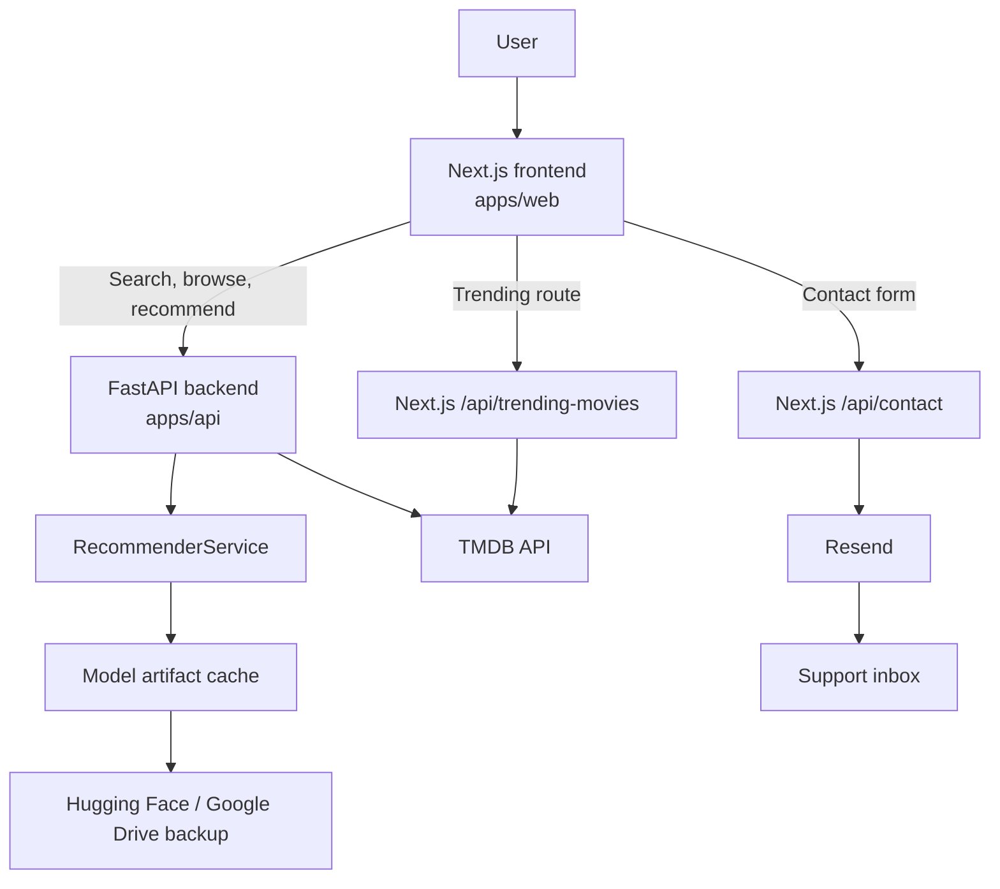
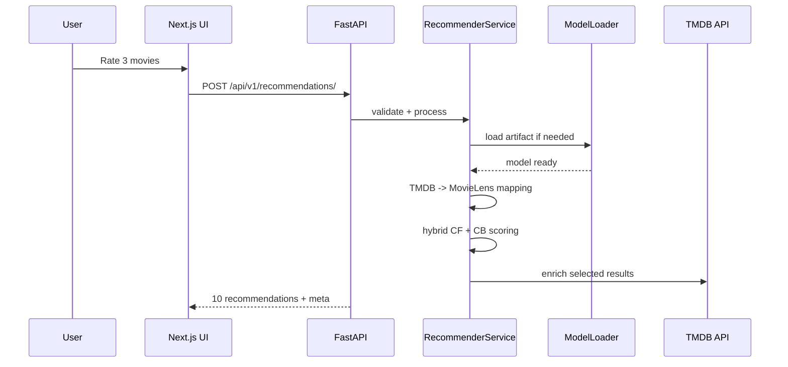

<div align="center">

<a href="https://wemovies.ai" target="_blank">
  <picture>
    
  </picture>
</a>

# WeMovies AI

**By Pijak Dicoding** · *in collaboration with IBM SkillsBuild*

**Team ID:** PJK-GM022 · **Theme:** AI for Smart Recommendation System

> WeMovies AI is a movie discovery app powered by a hybrid recommender system, TMDB metadata, runtime-loaded ML artifacts, and a production-ready contact flow.

[Website](https://wemoviesai.vercel.app) · [GitHub](https://github.com/aliimndev/capstone-project) · [Issues](https://github.com/aliimndev/capstone-project/issues) · [Docs](./docs)

</div>

WeMovies AI lets users search movies, rate **exactly 3 titles**, and receive **10 personalized recommendations** generated by a hybrid machine learning pipeline (**Collaborative Filtering + Content-Based Filtering**). The frontend is built with **Next.js 16 + React 19 + Tailwind**, while the backend runs on **FastAPI + scikit-learn** and loads its model artifact from **Hugging Face** at runtime.

---

## Highlights

- **Modern cinematic frontend** with video-backed UI, glassmorphism panels, and responsive layouts
- **Hybrid recommender** using CF + CB signals from a precomputed ML artifact
- **TMDB-powered search, trending, and metadata enrichment**
- **Fallback recommendations** from `top_trending` when rated movies are not mapped into the MovieLens catalog
- **Runtime model download** from Hugging Face with SHA-256 integrity verification and local caching
- **Production-safe contact form** using a Next.js route and **Resend**
- **Monorepo** structure for frontend, backend, proxy worker, and infra tooling

---

## Tech Stack

| Layer | Stack |
|---|---|
| Frontend | Next.js 16, React 19, TypeScript, Tailwind CSS, Motion, Lucide |
| Backend | FastAPI, Pydantic, scikit-learn, NumPy, pandas, SciPy |
| External APIs | TMDB, Resend, Hugging Face |
| Deployment | Vercel (frontend), Hugging Face Spaces Docker backend, optional Cloudflare Worker |
| CI/CD | GitHub Actions, GHCR |

---

## Architecture

See:[`docs/architecture.md`](docs/architecture.md)

---

## Monorepo Structure

```text
capstone-project/
├── apps/
│   ├── web/                 # Next.js frontend + App Router API routes
│   ├── api/                 # FastAPI backend + recommendation engine
│   └── proxy/               # Optional Cloudflare Worker TMDB proxy
├── docs/                    # Architecture / user-flow diagrams
├── hf-space/                # Hugging Face Space backend packaging
├── infra/                   # Docker Compose & local infrastructure helpers
├── .github/workflows/       # CI/CD pipelines
├── package.json             # Monorepo scripts
├── render.yaml              # Example container deployment config
└── vercel.json              # Vercel frontend config
```

---

## System Architecture

### High-level architecture



### Architecture diagrams

For detailed visuals, sequence diagrams, model-loading flow, deployment topology, and user flow, see:

- [`docs/architecture.md`](docs/architecture.md)

---

## How the Product Works

### User flow

1. Open the app on the frontend (`apps/web`)
2. Browse or search movies using TMDB-backed endpoints
3. Choose **3 movies** and rate them using one of:
   - `loved it`
   - `like it`
   - `just normal`
   - `dislike`
4. The frontend sends a recommendation request to FastAPI
5. FastAPI loads or reuses the ML artifact, performs scoring, enriches results with TMDB metadata, and returns **10 recommendations**
6. If the selected TMDB movies do not map to the internal MovieLens catalog, the app falls back to curated `top_trending` movies stored in the artifact

### Recommendation flow



---

## Runtime Model Loading (Important)

The backend **does not require `recommender_artifacts.pkl` to be committed to Git**.

Instead:

1. FastAPI starts up
2. `ModelLoader` checks whether the artifact exists locally at `apps/api/model/recommender_artifacts.pkl` (or `/app/model/recommender_artifacts.pkl` inside Docker)
3. If the file is missing, the backend downloads it from Hugging Face
4. The download is validated via **SHA-256**
5. The file is cached locally and reused on subsequent startups

This makes Docker and CI builds more reliable and avoids committing a 200+ MB binary to Git.

**Primary artifact source**: [aliimndev/recommender_artifacts.pkl on Hugging Face](https://huggingface.co/aliimndev/recommender_artifacts.pkl)  
**Google Drive model backup**: <https://drive.google.com/drive/folders/15e6JBAYuqJdMoE1-BXbyim3B2QzEzY5-?usp=sharing>

> For capstone assessment, the Google Drive folder contains the downloadable ML model artifact. Ensure the evaluator account `pijak@student.devacademy.id` has view/download access.

---

## Prerequisites

| Tool | Version |
|---|---|
| Node.js | 20+ |
| npm | 10+ |
| Python | 3.11+ |
| Git | Recent version |
| Docker | Optional |

You will also need:

- A **TMDB API key**: <https://www.themoviedb.org/settings/api>
- A **Resend API key** for real contact email delivery (optional for local dev; the contact route has a safe dev mode)

---

## Environment Variables

### Backend — `apps/api/.env`

| Variable | Required | Purpose |
|---|---|---|
| `TMDB_API_KEY` | Yes | TMDB metadata enrichment |
| `API_URL` | No | Public backend URL, defaults to `http://localhost:8000` |
| `HF_MODEL_URL` | No | Override Hugging Face artifact URL |
| `HF_MODEL_SHA256` | No | Expected SHA-256 for artifact integrity verification |
| `HF_DOWNLOAD_TIMEOUT` | No | Download timeout in seconds |
| `EXTRA_CORS_ORIGINS` | No | Additional comma-separated frontend origins |

> The FastAPI app reads `apps/api/.env` automatically via Pydantic settings.

### Frontend — `apps/web/.env.local`

The frontend environment file is intentionally not committed to GitHub. Create `apps/web/.env.local` manually using the variables below.

| Variable | Required | Purpose |
|---|---|---|
| `NEXT_PUBLIC_API_URL` | Yes | FastAPI base URL used by the recommendation UI |
| `TMDB_API_KEY` | Yes | Used by the Next.js `GET /api/trending-movies` route |
| `RESEND_API_KEY` | No for local dev / Yes for production | Enables real contact email delivery |
| `CONTACT_TO_EMAIL` | No | Support inbox destination |
| `CONTACT_FROM_EMAIL` | No | Verified sender address for Resend |

### Recommended local setup

#### `apps/api/.env`

```env
TMDB_API_KEY=your_tmdb_api_key
API_URL=http://localhost:8000
EXTRA_CORS_ORIGINS=http://localhost:3000
```

#### `apps/web/.env.local`

```env
NEXT_PUBLIC_API_URL=http://localhost:8000
TMDB_API_KEY=your_tmdb_api_key
RESEND_API_KEY=
CONTACT_TO_EMAIL=support@wemovies.ai
CONTACT_FROM_EMAIL=WeMovies AI <onboarding@resend.dev>
```

---

## Local Development Setup

### 1) Clone the repository

```bash
git clone https://github.com/aliimndev/capstone-project.git
cd capstone-project
```

### 2) Install frontend / monorepo dependencies

```bash
npm install

# Create apps/web/.env.local manually, then fill it using the variables in the Environment Variables section.
```

### 3) Set up the FastAPI backend

```bash
cd apps/api
python3 -m venv .venv
source .venv/bin/activate        # Linux/macOS
# .venv\Scripts\activate        # Windows
pip install -r requirements.txt
cp .env.example .env
# then edit apps/api/.env
```

### 4) Run the app locally

Use two terminals:

```bash
# Terminal 1 — FastAPI
npm run dev:api

# Terminal 2 — Next.js
npm run dev
```

Open:

- Frontend: <http://localhost:3000>
- FastAPI docs: <http://localhost:8000/api/docs>
- FastAPI health: <http://localhost:8000/health>

Production links:

- Live Demo: <https://wemoviesai.vercel.app/>
- Backend API: <https://aliimndev-wemovies-api.hf.space>
- API Documentation: <https://aliimndev-wemovies-api.hf.space/api/docs>

### 5) Optional: verify the model artifact manually

```bash
npm run verify:model
```

This script downloads the Hugging Face artifact, validates the SHA-256 hash, and runs inference checks.

> In normal development, you do **not** need to run this first — the backend can download the model automatically at runtime.

---

## Developer Workflow

### Frontend workflow

- `apps/web/app/` contains the App Router pages and route handlers
- `apps/web/components/` contains UI components
- `apps/web/features/recommendation/api.ts` calls FastAPI using `NEXT_PUBLIC_API_URL`
- `apps/web/app/api/contact/route.ts` handles contact form delivery via Resend

### Backend workflow

- `apps/api/app/main.py` boots the FastAPI app and loads the recommender during startup
- `apps/api/app/api/v1/endpoints/recommend.py` exposes the public recommendation/search/trending/discover endpoints
- `apps/api/app/services/recommender/` contains the recommendation engine, model loader, ID mapper, and TMDB enrichment helpers
- `apps/api/core/config.py` defines env-based backend configuration

### Contact form workflow 

- The frontend `Contact` page posts to `POST /api/contact`
- The Next.js route validates the payload
- If `RESEND_API_KEY` is configured, the route sends a real email using Resend
- If the key is missing, the route returns success in **dev mode** and logs the submission instead of failing local development

---

## API Reference

### FastAPI backend

| Method | Endpoint | Description |
|---|---|---|
| `GET` | `/` | Basic API info |
| `GET` | `/health` | API health + whether the model is loaded |
| `POST` | `/api/v1/recommendations/` | Generate 10 recommendations from 3 rated movies |
| `GET` | `/api/v1/recommendations/trending` | Browse trending titles |
| `GET` | `/api/v1/recommendations/search?q=...` | Search TMDB-backed movies |
| `GET` | `/api/v1/recommendations/discover?genre_id=...` | Discover movies by genre |
| `GET` | `/api/docs` | Swagger UI. Production: <https://aliimndev-wemovies-api.hf.space/api/docs> |

### Next.js server routes

| Method | Endpoint | Description |
|---|---|---|
| `POST` | `/api/contact` | Contact form submission -> Resend |
| `GET` | `/api/trending-movies` | Frontend-side TMDB trending helper |

### Recommendation request example

```json
{
  "rated_movies": [
    { "movie_id": 550, "reaction": "loved it" },
    { "movie_id": 278, "reaction": "like it" },
    { "movie_id": 680, "reaction": "just normal" }
  ]
}
```

Notes:

- `movie_id` is a **TMDB movie ID**
- The backend requires **exactly 3 rated movies**
- The original input movies do **not** appear in the output recommendations
- Response metadata includes inference timing, fallback usage, and unmapped TMDB IDs when relevant

---

## Model Details

| Property | Value |
|---|---|
| Approach | Hybrid collaborative filtering + content-based filtering |
| Alpha weights | `alpha_cf = 0.65`, `alpha_cb = 0.35` |
| Catalog size | ~80k MovieLens-linked titles |
| TMDB mappings | ~80k IDs |
| Latent matrix | `(80318, 100)` |
| Content features | `(80318, 5019)` |
| Artifact host | Hugging Face, with Google Drive backup for capstone review |

### Reaction weights

| Reaction | Weight |
|---|---|
| `loved it` | `2.0` |
| `like it` | `1.0` |
| `just normal` | `0.1` |
| `dislike` | `-1.5` |

---

## Deployment

### Frontend (Vercel)

The frontend is configured for Vercel via `vercel.json`.

Set these environment variables in Vercel:

- `NEXT_PUBLIC_API_URL`
- `TMDB_API_KEY`
- `RESEND_API_KEY`
- `CONTACT_TO_EMAIL`
- `CONTACT_FROM_EMAIL`

### Backend (Hugging Face Spaces)

The production backend is deployed as a Docker-based Hugging Face Space:

- Backend API: <https://aliimndev-wemovies-api.hf.space>
- API Documentation: <https://aliimndev-wemovies-api.hf.space/api/docs>
- Packaging path: `hf-space/`
- Deployment workflow: `.github/workflows/deploy-hf-space.yml`

Important behavior:

- The Docker image does not require the model artifact to be committed to Git
- The API container downloads the model artifact during build/startup depending on the deployment path
- The artifact is cached inside the backend model directory
- This removes the need for Git LFS or committing `recommender_artifacts.pkl`

The repo also includes:

- `apps/api/Dockerfile` — reusable Docker packaging for the FastAPI backend
- `render.yaml` — legacy/example Docker deployment config
- `.github/workflows/api-ci-cd.yml` — API CI/CD pipeline that tests, builds, and pushes the backend image to GHCR

### Optional Cloudflare Worker proxy

`apps/proxy/worker.ts` is an optional TMDB proxy / caching layer with its own deploy flow.

---

## Docker & Compose

### Build the API image

```bash
npm run docker:build
npm run docker:run
```

### Run the local stack with Docker Compose

```bash
npm run docker:up
```

**Current caveat:** `infra/docker-compose.yml` mounts `apps/api/model` into the container as **read-only**. That works if the model has already been downloaded locally, but on a fresh machine the API container cannot write the first Hugging Face download into that mount.

If you want to use `docker compose` on a brand-new checkout, either:

1. pre-populate `apps/api/model/recommender_artifacts.pkl`, or
2. remove/adjust the read-only model mount in `infra/docker-compose.yml`

---

## Validation & Testing

### Backend tests

```bash
npm run test:api
```

### Frontend checks

From `apps/web/`:

```bash
npm run lint
npx tsc -p tsconfig.json --noEmit
npm run build
```

### Health check

```bash
curl http://localhost:8000/health
```

---

## Troubleshooting

| Problem | What to check |
|---|---|
| `model_loaded: false` | Ensure the container / local machine can reach Hugging Face and write to the model cache directory |
| `503 Recommendation model is not available` | Check backend startup logs for model download or checksum failures |
| Contact form says success locally but no email arrives | `RESEND_API_KEY` is likely unset — local dev mode logs instead of sending |
| Contact form fails in production | Verify `RESEND_API_KEY`, `CONTACT_TO_EMAIL`, and `CONTACT_FROM_EMAIL` |
| Trending route fails in Next.js | Ensure `TMDB_API_KEY` is configured in `apps/web/.env.local` or Vercel |
| CORS issues | Set `EXTRA_CORS_ORIGINS` on the backend to include your frontend URL |
| Docker Compose API boot issue on a fresh machine | See the read-only model mount caveat above |

---

---

## Useful Scripts

| Script | Description |
|---|---|
| `npm run dev` | Run the frontend (`apps/web`) |
| `npm run dev:api` | Run FastAPI locally |
| `npm run dev:all` | Run frontend + backend together |
| `npm run test:api` | Run backend tests |
| `npm run verify:model` | Download + validate Hugging Face model artifact |
| `npm run docker:build` | Build the API Docker image |
| `npm run docker:run` | Run the API Docker image |
| `npm run docker:up` | Run the local Docker Compose stack |
| `npm run worker:dev` | Run the Cloudflare Worker locally |
| `npm run worker:deploy` | Deploy the Cloudflare Worker |

---

## License / Ownership

Capstone project by the **WeMovies AI Team - PJK-GM022**.
