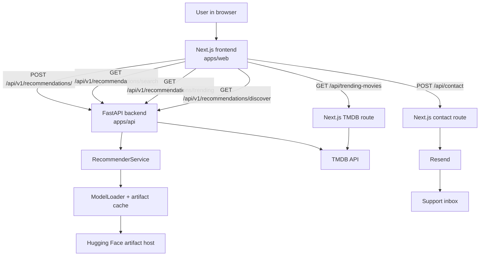
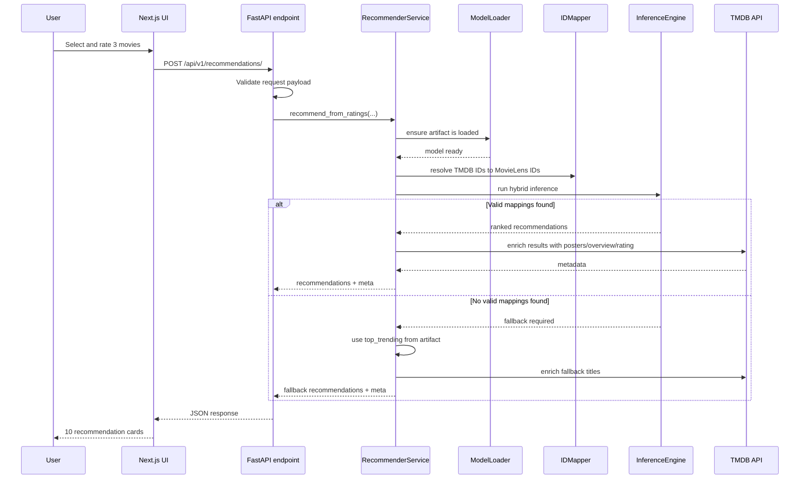
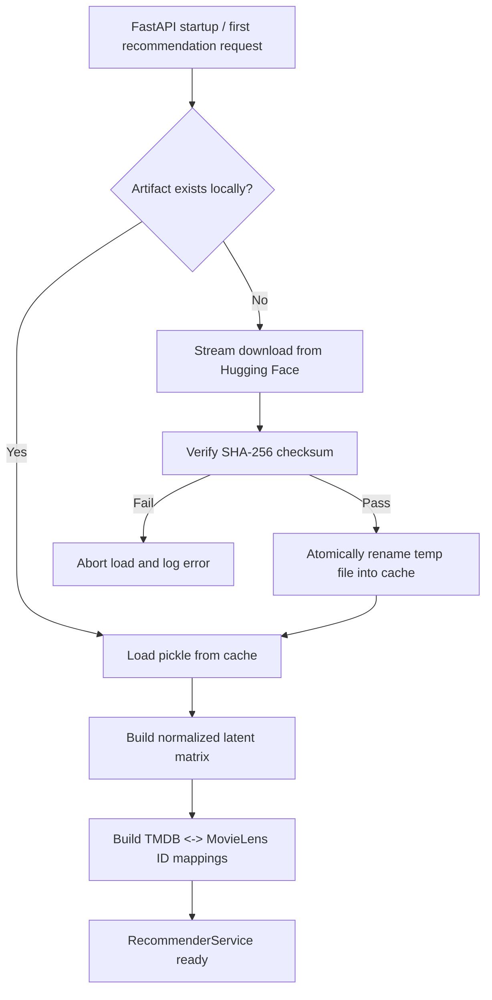
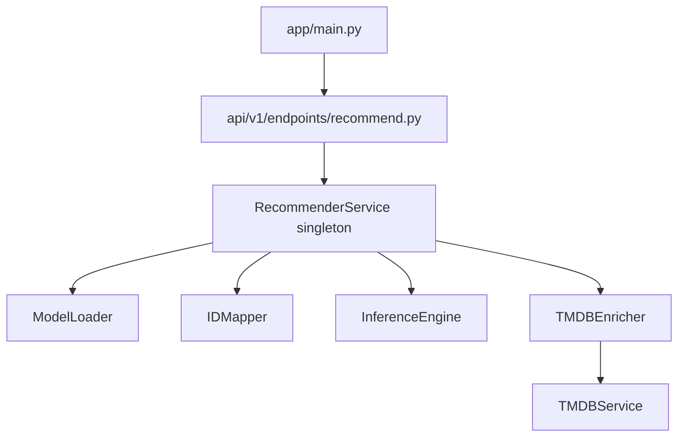
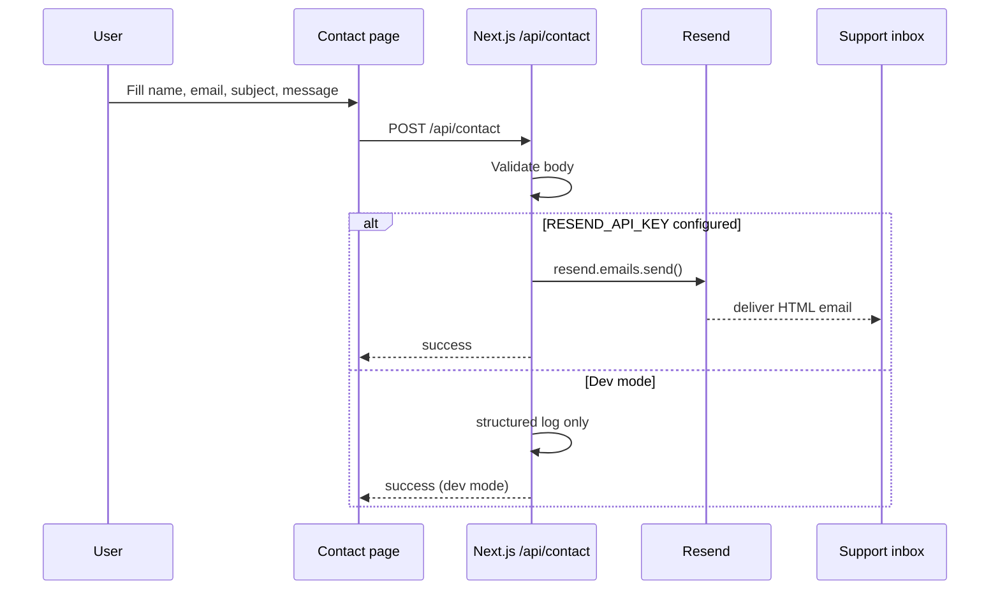
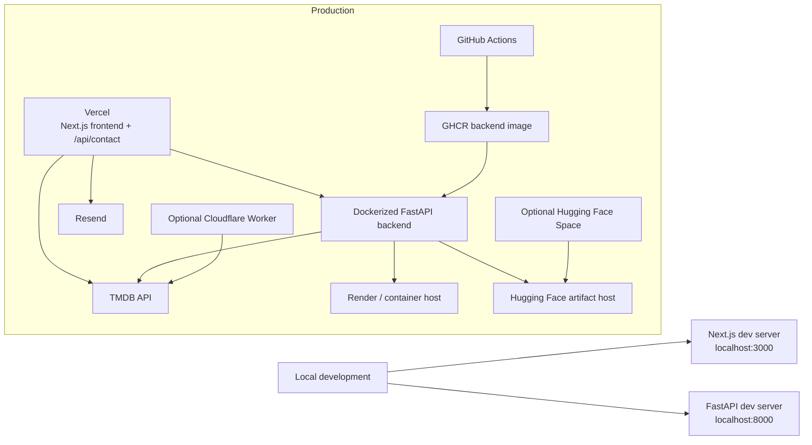

# WeMovies AI — Architecture Documentation

A production-grade overview of the current **real implementation** of WeMovies AI after the recent refactors, runtime model-loading changes, contact form email integration, and deployment updates.

This document is intended to be easy to scan for:

- contributors onboarding to the codebase
- interviewers / recruiters reviewing system design
- open-source readers trying to understand the stack quickly
- maintainers debugging runtime, deployment, or model-loading issues

---

## Table of Contents

1. [Project Architecture Overview](#project-architecture-overview)
2. [High-level System Diagram](#high-level-system-diagram)
3. [Recommendation Pipeline](#recommendation-pipeline)
4. [Runtime Model Loading](#runtime-model-loading)
5. [Frontend Structure](#frontend-structure)
6. [Backend Structure](#backend-structure)
7. [Contact Form & Email Delivery](#contact-form--email-delivery)
8. [Deployment Architecture](#deployment-architecture)
9. [Environment Variables](#environment-variables)
10. [Developer Experience](#developer-experience)
11. [Troubleshooting Notes](#troubleshooting-notes)

---

## Project Architecture Overview

WeMovies AI is a **monorepo** with three primary application layers:

| Layer | Location | Responsibility |
|---|---|---|
| Frontend | `apps/web` | User-facing Next.js application, recommendation UI, contact form, responsive cinematic presentation |
| Backend | `apps/api` | FastAPI recommendation service, TMDB integration, model lifecycle, inference pipeline |
| Proxy (optional) | `apps/proxy` | Cloudflare Worker for optional TMDB proxying / caching |

Supporting infrastructure:

| Support System | Role |
|---|---|
| Hugging Face | Hosts the large `recommender_artifacts.pkl` model artifact |
| Resend | Sends real contact form emails |
| TMDB API | Powers search, trending, metadata enrichment, and discover flows |
| Docker | Packages the FastAPI backend |
| GitHub Actions | Tests, builds, and pushes the backend container image |
| Vercel | Frontend deployment platform |
| Render / other container host | Example backend runtime target |
| Hugging Face Spaces (optional) | Alternate backend deployment path |

---

## High-level System Diagram



### What this means in practice

- The **frontend does not run ML logic directly**.
- All recommendation logic lives in **FastAPI**.
- The **ML artifact is not committed to git** and is fetched at runtime if missing.
- The **contact form does not touch FastAPI**; it is handled by a **Next.js route** and Resend.

---

## Recommendation Pipeline

### Request lifecycle

Users interact with the recommendation flow in the frontend by:

1. searching for movies
2. selecting **exactly 3** titles
3. assigning one reaction to each title:
   - `loved it`
   - `like it`
   - `just normal`
   - `dislike`

The frontend sends this payload to FastAPI:

```json
{
  "rated_movies": [
    { "movie_id": 550, "reaction": "loved it" },
    { "movie_id": 278, "reaction": "like it" },
    { "movie_id": 680, "reaction": "just normal" }
  ]
}
```

### Recommendation request flow



### How inference works

The recommender combines two signals:

| Signal | Source | Purpose |
|---|---|---|
| Collaborative filtering | latent factors (`movie_latent_matrix`) | learns taste similarity from historical interaction structure |
| Content-based filtering | `content_features` | uses item metadata / representation similarity |

### Scoring behavior

- A user profile is constructed from the 3 rated movies
- Each selected movie contributes with a different weight depending on the reaction
- The engine blends collaborative and content-based scores using:
  - `alpha_cf = 0.65`
  - `alpha_cb = 0.35`
- Already rated items are excluded from the final ranked list
- If fewer than `top_n=10` recommendations are available, the pipeline fills from `top_trending`

### Response enrichment

The raw ML output only knows internal IDs and limited title metadata. The backend then enriches the recommendation set using TMDB so the frontend gets:

- poster path
- overview
- release date
- vote average
- genres
- tmdbId for routing / display

---

## Runtime Model Loading

The current architecture intentionally **does not store the ML model binary in git**.

### Why this architecture was chosen

The artifact is about **216 MB**, which is too large for normal GitHub commit workflows. Earlier attempts to bake the model into Docker or store it in the repo caused CI/CD friction and unstable builds.

The current design solves this by:

- storing the artifact on **Hugging Face**
- downloading it **on first startup** if missing
- verifying it using **SHA-256**
- caching it locally for subsequent restarts

### Model loading flow



### Runtime behavior details

Current implementation in `apps/api/app/services/recommender/model_loader.py`:

- downloads to a temporary sibling file like `recommender_artifacts.pkl.tmp`
- verifies SHA-256 before promoting the file to the final cache path
- uses atomic rename to avoid partially written corrupted artifacts
- stores the artifact at:
  - local dev: `apps/api/model/recommender_artifacts.pkl`
  - container runtime: `/app/model/recommender_artifacts.pkl`

### Cache behavior

- first startup on a fresh machine/container: **download + verify + cache**
- subsequent startups: **reuse local cached artifact**
- repeated `load()` calls in-process: **skip reload** via singleton loader state

---

## Frontend Structure

The frontend lives in `apps/web` and uses the **Next.js App Router**.

### Frontend directory structure

| Path | Purpose |
|---|---|
| `apps/web/app/` | app routes, layouts, API routes |
| `apps/web/components/` | reusable UI building blocks |
| `apps/web/features/` | feature-specific API clients / logic |
| `apps/web/app/api/contact/route.ts` | contact form delivery route |
| `apps/web/app/api/trending-movies/route.ts` | server-side TMDB helper route |

### Frontend route map

| Route | Purpose |
|---|---|
| `/` | Home page |
| `/about` | Product / team / feature explanation |
| `/recommend` | Recommendation workflow UI |
| `/contact` | Contact form |
| `/privacy-policy` | Static policy page |
| `/api/contact` | Email delivery route |
| `/api/trending-movies` | Next.js TMDB route |

### Recommendation UI flow

```mermaid
flowchart LR
    Home[Landing / navigation] --> RecommendPage[/recommend]
    RecommendPage --> Search[Search movies]
    Search --> Select[Select movie]
    Select --> Rate[Choose reaction]
    Rate --> Summary[Selection summary]
    Summary --> SubmitAuto[Auto request when 3 movies are rated]
    SubmitAuto --> Render[Render recommendation cards]
    Render --> Modal[Movie modal / detail interactions]
    Modal --> Share[Share or further explore]
```

### Key frontend UX systems

#### 1. Responsive App Router layout

`apps/web/app/layout.tsx` provides:

- the global shell
- sticky header/footer integration
- shared background layers
- global fonts and CSS

#### 2. Responsive cinematic video background system

The fullscreen background video now lives in `apps/web/components/layout/BackgroundVideo.tsx`.

It is responsible for:

- mobile-safe autoplay handling
- `pointer-events-none` to prevent accidental pause/tap interactions
- `playsInline`, `muted`, `loop`, `autoPlay`
- visibility re-play attempts
- fallback play on first user interaction if autoplay is blocked
- layering the video below all content and overlay elements
- using `object-cover`, `object-center`, `h-[100dvh]`, and GPU hints for stability

#### 3. Modal / trailer / share interaction system

The recommendation experience is built from reusable components in `apps/web/components/recommend/`, including:

- movie selection/search
- recommendation cards
- modal/detail presentation
- selection summary
- share interactions
- UI state components for loading, errors, and empty results

---

## Backend Structure

The backend lives in `apps/api` and is organized around FastAPI endpoints plus a small service layer.

### Backend directory structure

| Path | Purpose |
|---|---|
| `apps/api/app/main.py` | FastAPI entry point |
| `apps/api/app/api/v1/endpoints/` | REST endpoints |
| `apps/api/app/services/` | orchestration + TMDB + recommender facade |
| `apps/api/app/services/recommender/` | model loader, ID mapping, inference, enrichment |
| `apps/api/app/schemas/` | Pydantic schemas |
| `apps/api/core/` | configuration |
| `apps/api/tests/` | API and inference tests |
| `apps/api/scripts/` | model verification utilities |

### Backend internal architecture



### Service responsibilities

| Component | Responsibility |
|---|---|
| `RecommenderService` | façade for loading, mapping, inference, fallback, enrichment |
| `ModelLoader` | download, checksum verification, caching, pickle load |
| `IDMapper` | TMDB ↔ MovieLens ID translation |
| `InferenceEngine` | hybrid scoring, exclusion logic, fallback fill |
| `TMDBEnricher` | attaches user-facing metadata to recommendations |
| `TMDBService` | wraps TMDB REST calls |

### Runtime startup flow

FastAPI uses a lifespan hook in `apps/api/app/main.py`:

1. app boots
2. lifespan calls `get_recommender_service()`
3. singleton service calls `load()`
4. model downloads if necessary
5. ID mappings are built
6. service remains in memory for subsequent requests

### Singleton recommender lifecycle

`get_recommender_service()` returns a module-level singleton.

This means:

- the artifact is loaded **once per process**
- mappings are built **once per process**
- subsequent requests reuse the already initialized service
- recommendation endpoints return `503` if startup failed and the service is not loaded

---

## Contact Form & Email Delivery

The contact form is handled entirely on the frontend platform side via a **Next.js route**, not FastAPI.

### Contact flow



### What gets sent

The email includes:

- sender name
- sender email
- subject
- message body
- timestamp
- HTML email formatting for support-friendly inbox display

### Why this is implemented in Next.js

This architecture keeps the contact form:

- close to the frontend deployment target (Vercel)
- independent from backend recommendation infrastructure
- easy to validate and deploy via environment variables
- safe for local development through dev-mode logging

---

## Deployment Architecture

### High-level deployment flow



### Frontend deployment

**Platform:** Vercel

Responsibilities:

- serves Next.js pages
- serves `POST /api/contact`
- serves `GET /api/trending-movies`
- reads frontend environment variables

### Backend deployment

**Primary packaging path:** `apps/api/Dockerfile`

Behavior:

- image contains application code only
- no committed ML artifact required
- model is downloaded on first startup
- healthcheck probes `/health`

### CI/CD

GitHub Actions currently:

- tests and lints the API
- builds and pushes the backend Docker image to **GHCR**
- includes optional deploy paths for supporting services

### Hugging Face artifact hosting

Hugging Face is currently used as:

- the source of truth for `recommender_artifacts.pkl`
- the runtime download origin for backend startup
- an optional hosting path for `hf-space/`

---

## Environment Variables

### Backend (`apps/api/.env`)

| Variable | Required | Purpose |
|---|---|---|
| `TMDB_API_KEY` | Yes | TMDB metadata enrichment |
| `API_URL` | No | Public backend URL |
| `HF_MODEL_URL` | No | Override artifact source |
| `HF_MODEL_SHA256` | No | Artifact integrity verification |
| `HF_DOWNLOAD_TIMEOUT` | No | Download timeout in seconds |
| `EXTRA_CORS_ORIGINS` | No | Additional allowed frontend origins |

### Frontend (`apps/web/.env.local`)

| Variable | Required | Purpose |
|---|---|---|
| `NEXT_PUBLIC_API_URL` | Yes | FastAPI base URL |
| `TMDB_API_KEY` | Yes | Used by the Next.js TMDB route |
| `RESEND_API_KEY` | Optional locally / required in production | Enables real email delivery |
| `CONTACT_TO_EMAIL` | No | Destination inbox |
| `CONTACT_FROM_EMAIL` | No | Sender address |

---

## Developer Experience

### Local development commands

### Frontend

```bash
cd apps/web
npm run dev
```

### Backend

```bash
npm run dev:api
```

### Run both manually in separate terminals

```bash
npm run dev:api
npm run dev
```

### Validation commands

#### Frontend

```bash
cd apps/web
npm run lint
npx tsc --noEmit
npm run build
```

#### Backend

```bash
npm run test:api
```

### Model verification utility

```bash
npm run verify:model
```

This script is useful when you want to:

- manually fetch the artifact
- validate its checksum
- run inference and HTTP checks outside normal startup

---

## Troubleshooting Notes

| Problem | Likely cause | What to check |
|---|---|---|
| `model_loaded: false` | startup load failed | verify Hugging Face access and write permissions to the model cache directory |
| `503 Recommendation model is not available` | singleton failed to initialize | inspect FastAPI startup logs |
| contact form works locally but no email arrives | dev mode fallback | `RESEND_API_KEY` is probably not set |
| Docker backend works locally but compose fails on a fresh machine | read-only model mount | `infra/docker-compose.yml` mounts `apps/api/model` as read-only |
| TMDB enrichment missing | invalid or missing TMDB key | verify `TMDB_API_KEY` |
| CORS issue in browser | backend origin config mismatch | set `EXTRA_CORS_ORIGINS` correctly |

---

## Summary

The current architecture deliberately separates concerns:

- **Next.js** owns user experience, presentation, contact handling, and lightweight frontend-side routes
- **FastAPI** owns recommendation logic, model lifecycle, TMDB enrichment, and API contracts
- **Hugging Face** owns large artifact hosting
- **Resend** owns contact email delivery
- **Docker + GitHub Actions** own backend packaging and CI/CD

This gives the project a practical balance of:

- good developer experience
- lightweight frontend deployment
- stable backend model handling
- scalable service separation
- portfolio-friendly architectural clarity
